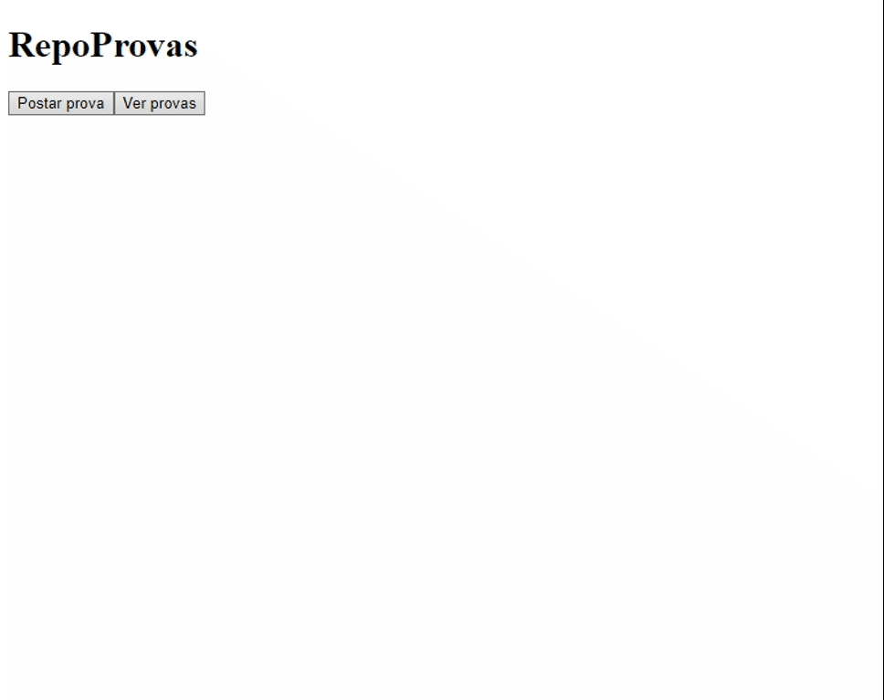

#   RepoProvas (front-end)

Share and search for old exams to help you study.  
Check the back-end of this application [here](https://github.com/gmtorres95/RepoProvas-back)  
Check the this application in production [here](https://repoprovas-one.vercel.app)

## Technologies

<div styles="display: flex">
  
  
  
</div>

## Preview



## How to run

### Install the application

```bash
# Clone this repository
$ git clone https://github.com/gmtorres95/RepoProvas-front

# Install the dependencies
$ npm i
```

### Run the application

```bash
$ npm start
```

The server will automatically start at localhost:3000/
